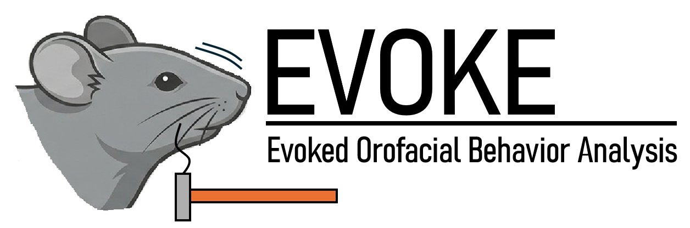

# EVOKE: Evoked Orofacial Behavior Analysis


EVOKE was developed by **Darian Mohsenin** between 2024 and 2026.

## Overview
A modular pipeline for processing orofacial pain behavioral data. This system automates the transfer, labeling, and metric extraction of mouse behavior videos across multiple research projects.


## Getting Started

### Initialize Data Root Folder
Open the GUI and select Project from the dropdown selection. On the same line to the right, press 'Initialize Data Root', select a location to create data folder. This folder will hold video files so make sure the location can handle large files. The pipeline_config.YAML will automatically be populated with directory paths to data folders.

### Configure the Environment
Edit the pipeline_config.YAML to set user-specific files paths! If data root is initialized then the data folders should be set already.

### Launch the GUI (Recommended)
The easiest way to run the pipeline is through the GUI. This handles background threading so the app doesn't freeze during long analysis runs. [python gui_launcher.py]

### Semi-Automated Analysis Phrases
File Transfer: Runs Steps 1–2

Manual Frame Correction: Run Step 3 and MANUALLY adjust frame of stimulation onset

Evoked Analysis: Runs Steps 4–8


## Core Components
pipeline_config.yaml: The source of user-specific filepaths & settings. Edit this file to change folder locations, FFmpeg paths, or DLC model paths.

config.py: The internal reader that feeds the YAML settings into every step of the pipeline.

gui_launcher.py: Launches GUI that is the base for running analysis.

## Project Directory Structure
```
│
├── [External Drive; Data collection drive] 
│   └── raw_files_from_data_collection_machine/         # Source files from data capture
│
├── [Local Machine; Project hardrive]
│   ├── orofacial_project/                              # Project 1 (TN)
│   │   ├── data/
│   │   │   ├── evoked/
│   │   │   │   ├── raw_files/                          # Destination of Step 1 (File Transfer)
│   │   │   │   └── processed_files/                    # Output of Step 4 (Evoked Clips)
│   │   │   └── metadata.csv                            # Master experiment sheet
│   │   └── analysis/
│   │       └── evoked/
│   │           ├── large_csv_files/                    # Save location of Step 7 (compiled experiment .csv)
│   │           └── summary_csv_files/                  # Save location of Step 8 (behavior kinematics .csv)
│   │
│   └── tmd_project/                                    # Project 2 (TMD)
│       └── [Parallel structure to orofacial_project]
│   │
│   └── migraine_project/                               # Project 3 (Migraine)
│       └── [Parallel structure to orofacial_project]
│
└── [Local Machine; Codebase harddrive]
    ├── evoked_behavior_analysis_pipeline/
        ├── config.py                                   # YAML Reader logic
        ├──pipeline_config.yaml                         # Master Control (User defined filepaths)
        ├──README.md                                    # Thank you for reading this!
        ├──gui_launcher.py                              # Launch analysis pipeline from here!
        ├──requirements.txt                             # Required Python Packages
        ├── analysis_scripts/
            ├── Step1_Transfer.py
            ├── ...
            ├── Step8_Extraction.py
```

## Contact
This analysis was created by the Xiaobing Yu Lab at University of California, San Francisco

Darian Mohsenin

Email: darian.mohsenin@ucsf.edu GitHub: dmohsenin
